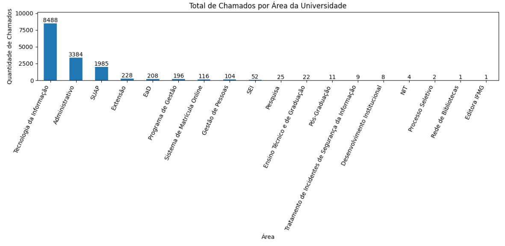
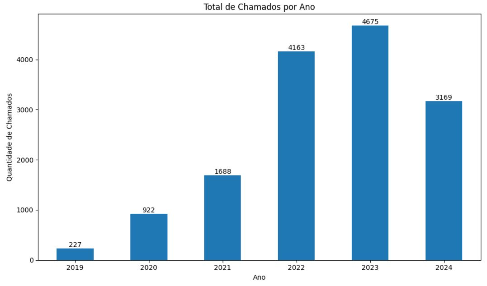
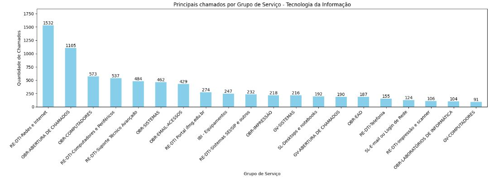
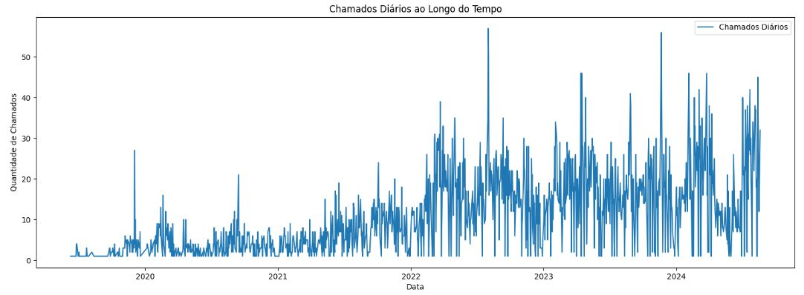
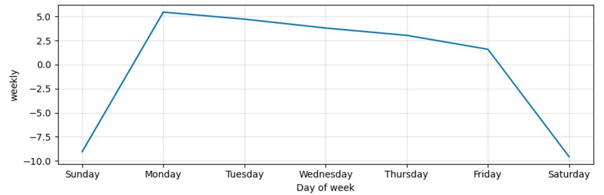
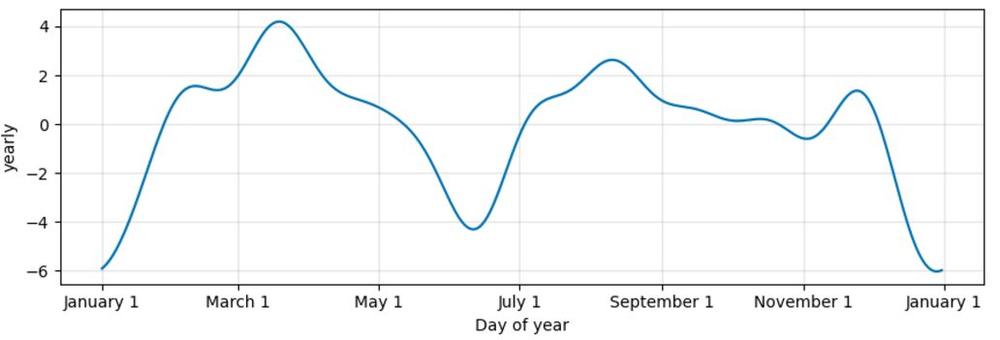

:small_blue_diamond: 🇵🇹
### Registros de solicitações de manutenção no Instituto Federal de Minas Gerais (IFMG)  

#### Objetivo do projeto

Esse projeto tem como objetivo analisar os dados de solicitações de manutenção (predial e informática) e verificar a previsão de demanda de futuros chamados.  

#### Fonte de dados

Como fonte de dados, foram utilizadas bases de dados públicas de 2019 a agosto de 2024, disponibilizadas pelo IFMG.

:file_folder: Link para acesso a base de dados [aqui](https://dadosabertos.ifmg.edu.br/dataset/chamados-de-suporte)
 
 

#### Tecnologias e ferramentas

:computer: Linguagem de programação <strong>Python</strong> e <strong>Google Colab</strong>.

:books: Bibliotecas utilizadas:
<li> pandas: para manipulação e análise de dados. </li>
<li> numpy: para operações numéricas e manipulação de arrays. </li>
<li> matplotlib e seaborn: criação de gráficos e visualizações de dados. </li>

<li> prophet: ferramenta de modelagem de séries temporais, projetada para fazer previsões de séries temporais com dados que apresentam padrões sazonais e feriados. </li>
<li> scikit-Learn: A função mean_absolute_error e a função mean_squared_error, ambas da biblioteca sklearn.metrics, são usadas para medir a diferença entre valores reais e valores previstos em problemas de regressão. </li>

#### Alguns resultados

:chart_with_downwards_trend: Total de solicitações por Área: o maior número de solicitações é correspondente a área de Tecnologia da Informação.

  

  

:chart_with_downwards_trend: Total de solicitações por Ano: até o momento 2023 apresenta a maior frequência de abertura de solicitações.

  

  

:chart_with_downwards_trend: Total de solicitações por Grupo de Serviço quando a área é igual a Tecnologia da Informação: o tipo de solicitação com maior número de solicitações é relacionado ao item RE-DTI-Redes e Internet

  

  

:chart_with_downwards_trend: Comportamento diário de solicitações durante os anos

  

  

:chart_with_downwards_trend: Previsão semanal de solicitações: excluindo o final de semana (sábado e domingo), nota-se que segunda-feira tem a tendência de ser o dia com maior número de abertura de solicitações de manutenção e sexta-feira o dia com menor número de solicitações

  

  

:chart_with_downwards_trend: Previsão anual de solicitações: o final do mês de março tende a ser o momento com maior frequência de números de novas solicitações e isso pode ocorrer devido ao início do ano letivo.

  

:small_blue_diamond: :small_blue_diamond: :small_blue_diamond: :small_blue_diamond: :small_blue_diamond: 

### Maintenance request records at the Instituto Federal de Minas Gerais (IFMG)  

#### Project objective

This project aims to analyze data on maintenance requests (building and IT) and verify the forecast demand for future calls.  

#### Data source

As a data source, public databases from 2019 to August 2024, made available by IFMG, were used.

:file_folder: Link to access the database [here](https://dadosabertos.ifmg.edu.br/dataset/chamados-de-suporte)
 
 

#### Technologies and tools

:computer: <strong>Python</strong> and <strong>Google Colab</strong> programming languages.

:books: Libraries used:
<li> pandas: for data manipulation and analysis. </li>
<li> numpy: for numerical operations and array manipulation. </li>
<li> matplotlib and seaborn: creating graphs and data visualizations. </li>

<li> prophet: a time series modeling tool, designed to make time series predictions with data that exhibit seasonal patterns and holidays. </li>
<li> scikit-Learn: The mean_absolute_error function and the mean_squared_error function, both from the sklearn.metrics library, are used to measure the difference between actual values ​​and predicted values ​​in regression problems. </li>

#### Some results

:chart_with_downwards_trend: Total requests by Area: the largest number of requests corresponds to the Information Technology area.

  

:chart_with_downwards_trend: Total requests by Year: so far 2023 has the highest frequency of requests being opened.

  

:chart_with_downwards_trend: Total requests by Service Group when the area is equal to Information Technology: the type of request with the highest number of requests is related to the item RE-DTI-Networks and Internet

  

:chart_with_downwards_trend: Daily behavior of requests during the years

  

:chart_with_downwards_trend: Weekly forecast of requests: excluding the weekend (Saturday and Sunday), it is noted that Monday tends to be the day with the highest number of requests opened maintenance and Friday the day with the lowest number of requests

  

:chart_with_downwards_trend: Annual forecast of requests: the end of March tends to be the time with the highest number of new requests and this may be due to the beginning of the school year.

  

